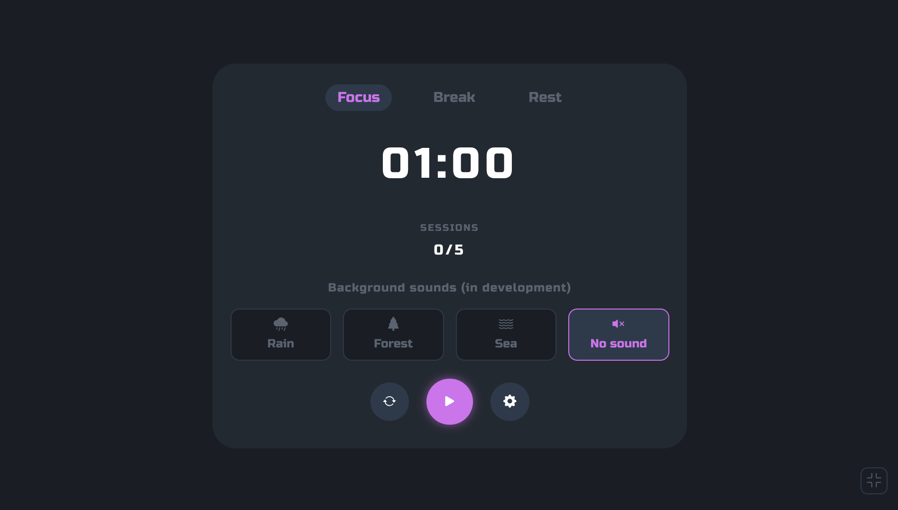
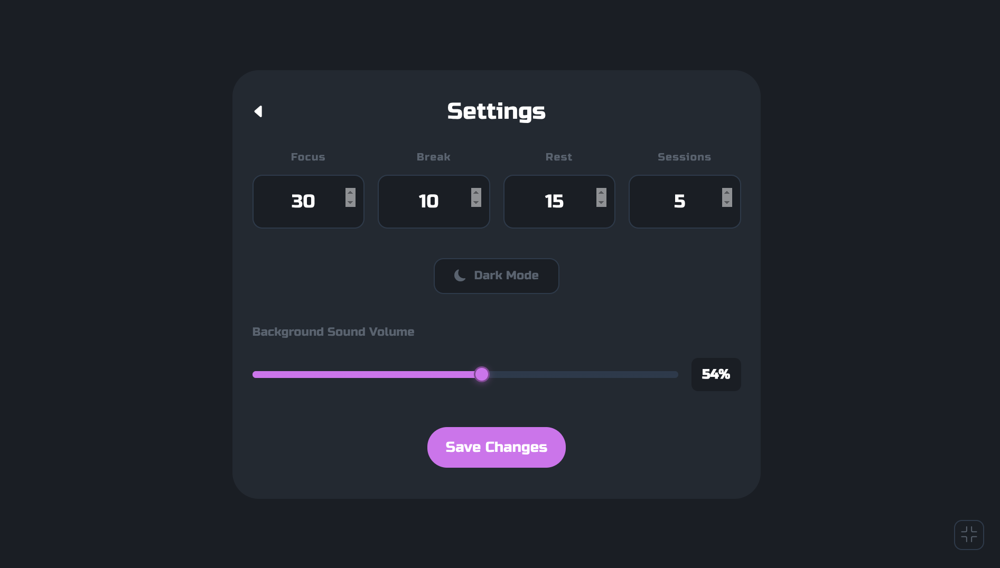
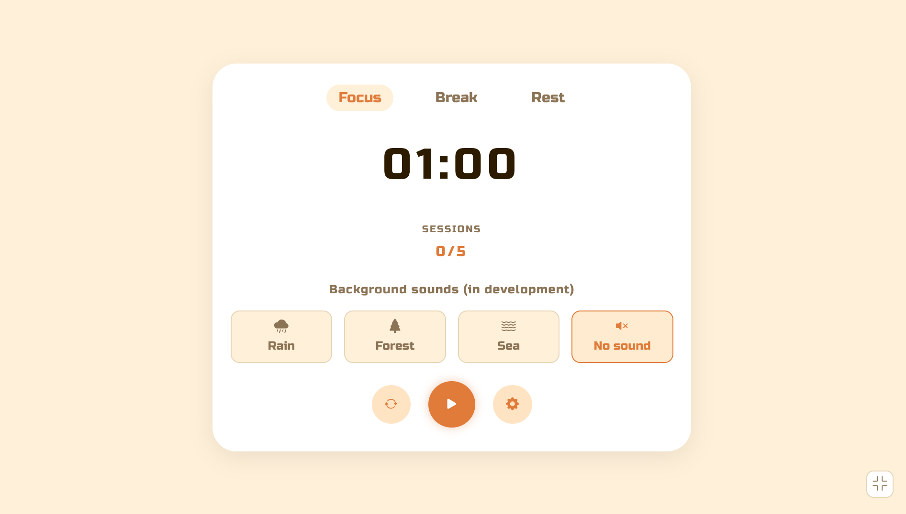
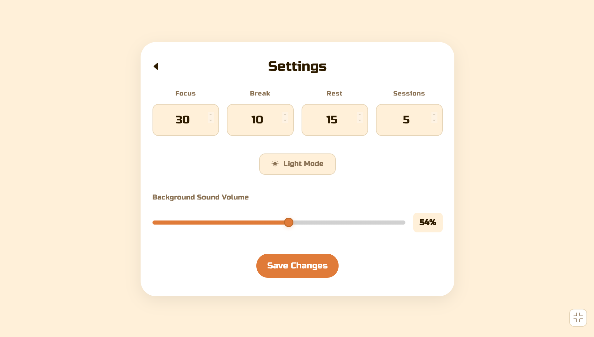

# Pomodoro Timer

## Pictures

**Dark Theme**




**Light Theme**





## Installation

**Step one:** Cloning this repository.

```
git clone https://github.com/XDKAY/Pomodoro-Timer.git
```

**Step two:** Go to the directory.
```
cd pomodoro-timer
```

**Step three:**

Creates a virtual environment.

```
uv venv
```

Activating the virtual environment.

Linux/Mac
```
source .venv/bin/activate
```

Windows
```
.venv\Scripts\activate
```


Installing all dependencies

```
uv sync
```

**Step four:** 
Launch the application, go to 
`http://0.0.0.0:8000/` and we use the app.

Run: 
```
fastapi run main.py
```
